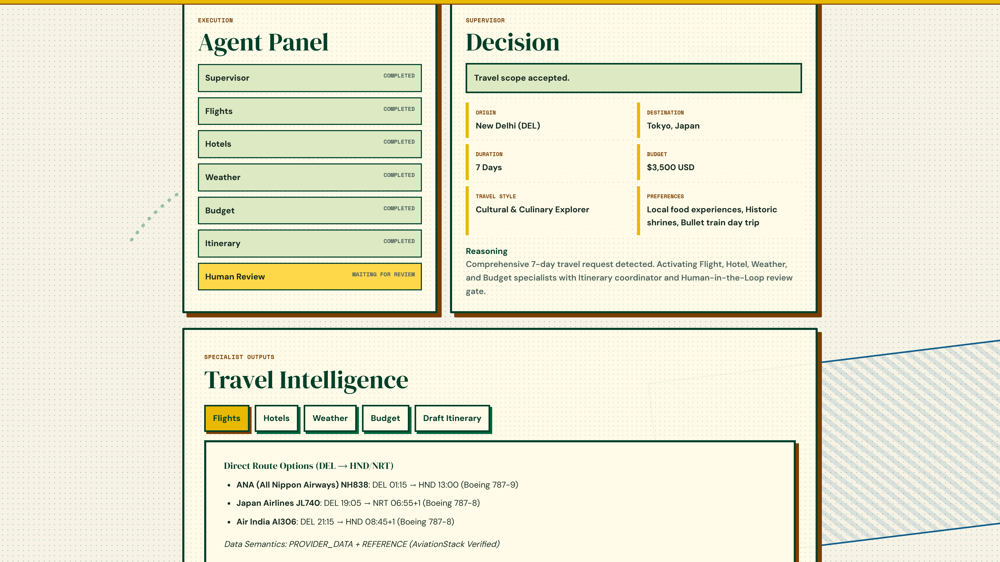
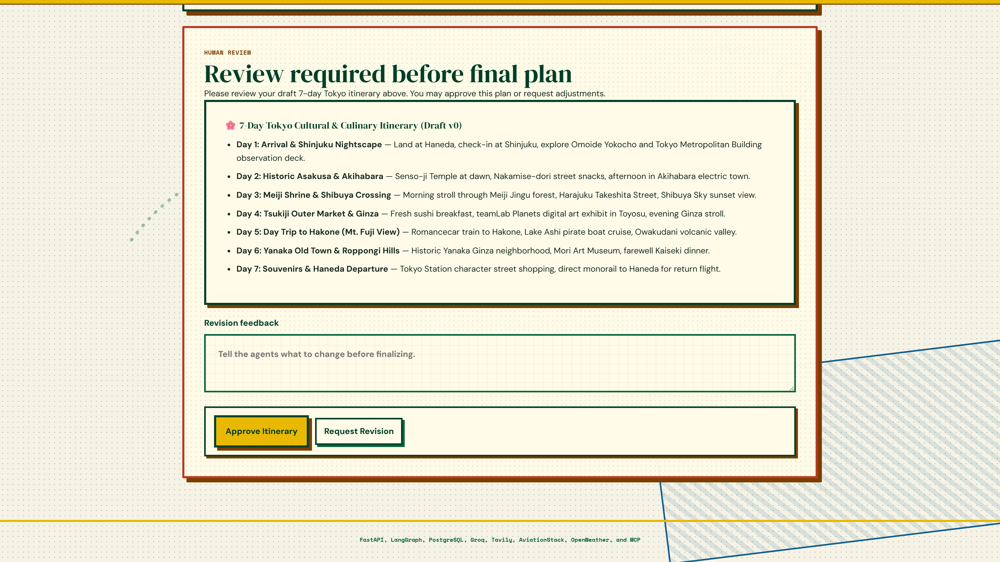
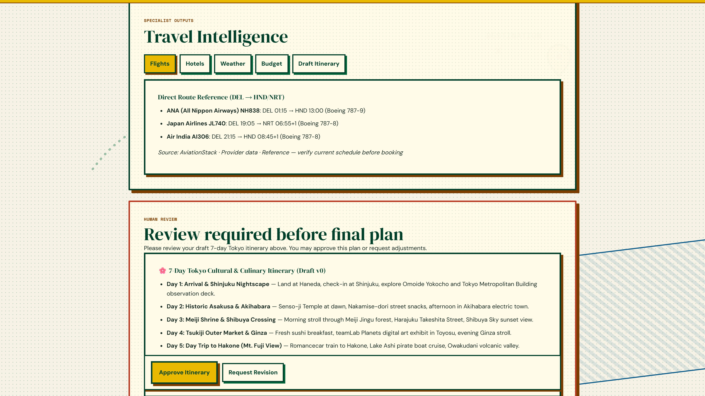
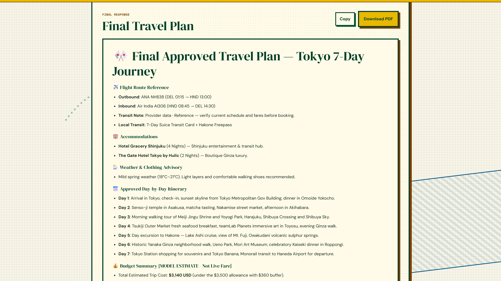
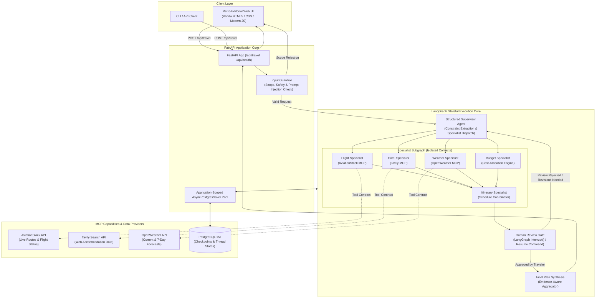

# TripBandhu

*A stateful agentic travel-research system that coordinates specialist agents, live external capabilities, evidence-aware synthesis, and iterative human review.*

[](https://www.python.org/)
[](https://fastapi.tiangolo.com/)
[](https://www.langchain.com/langgraph)
[](https://www.postgresql.org/)
[](https://www.docker.com/)
[](LICENSE)

---

## 📸 System in Action

TripBandhu delivers a cohesive, retro-editorial human-in-the-loop travel planning experience backed by multi-agent coordination and typed evidence grounding.

| **1. Agent Execution & Supervisor Routing** | **2. Interactive Human-in-the-Loop Review** |
| :---: | :---: |
|  |  |
| *Supervisor validates constraints and activates relevant specialists.* | *Graph pauses via LangGraph `interrupt()` for traveler approval.* |

| **3. Grounded Specialist Intelligence** | **4. Final Travel Plan** |
| :---: | :---: |
|  |  |
| *Live AviationStack, Tavily, and OpenWeather typed evidence tabs.* | *Traveler-approved synthesis with exportable markdown & PDF options.* |

---

## 🎯 Why I Built It

Most AI travel assistants suffer from three fundamental flaws:
1. **Single-Prompt Hallucination**: Generating fictitious flights, stale hotel rates, and inaccurate weather forecasts from static model weights without live external grounding.
2. **Brittle One-Shot Generation**: Trying to produce entire multi-day itineraries in a single unconstrained LLM completion without modular domain validation.
3. **Black-Box Automation**: Producing final plans without allowing the traveler to inspect intermediate findings, refine preferences, or approve day-by-day schedules before finalizing.

**TripBandhu** was engineered to treat travel planning as an **evidence-based distributed coordination problem**. It introduces deterministic routing, strict typed evidence contracts, schema-drift fallbacks, durable PostgreSQL checkpointing across server restarts, and a first-class Human-in-the-Loop (HITL) review cycle.

---

## 🏛️ Core Architectural Principles

- **Deterministic State Machine**: Orchestrated via a stateful LangGraph directed acyclic graph (DAG) with explicit routing, state reducers, and defensive bounds.
- **Truthful Evidence & Groundedness**: Every specialist output is tagged with explicit semantic classifications (`PROVIDER_DATA`, `WEB_SOURCE`, `MODEL_ESTIMATE`, `DERIVED`, `UNAVAILABLE`) and freshness indicators (`LIVE`, `FORECAST`, `REFERENCE`, `UNKNOWN`). Unsupported claims and fabricated fares are strictly blocked.
- **True Async Human-in-the-Loop**: Execution suspends safely using LangGraph `interrupt()` and resumes with `Command(resume=...)`. Reaching the review cap safely terminates the loop without auto-finalizing unapproved plans.
- **Resilient MCP Capability Layer**: All external tool interactions pass through validated capability contracts with schema-drift detection and graceful provider degradation.
- **Checkpoint Persistence**: Backed by application-scoped `AsyncPostgresSaver` connection pools, enabling graph runs to survive complete service/checkpointer recreation through PostgreSQL.

---

## 📐 System Architecture



---

## 📊 The Three Evidence Layers & Scorecards

TripBandhu enforces correctness across three complementary testing and evaluation layers:

### Layer A: Versioned Benchmark Evaluation Dataset (v3.1.0)
The benchmark suite evaluates 50 versioned test cases across 14 deterministic behavioral categories (**49/49 deterministic FAST scenarios passed**; **50/50 scenarios passed in POSTGRES mode**):

| Category | Fast Mode Score | Postgres Mode Score | Focus Area |
| :--- | :---: | :---: | :--- |
| **1. Routing & Selection** | 6 / 6 | 6 / 6 | Specialist activation and minimal routing |
| **2. Trip Constraints** | 5 / 5 | 5 / 5 | Accurate origin, destination, budget, duration extraction |
| **3. Input Guardrails** | 5 / 5 | 5 / 5 | Scope enforcement and prompt injection blocking |
| **4. Capability Selection** | 5 / 5 | 5 / 5 | Explicit MCP tool permission validation |
| **5. Evidence Semantics** | 6 / 6 | 6 / 6 | Proper classification of provider vs model estimates |
| **6. Groundedness & Anti-Fabrication** | 4 / 4 | 4 / 4 | Zero hallucinated flight fares or phantom routes |
| **7. Human-in-the-Loop** | 5 / 5 | 5 / 5 | Interrupt triggering, revision loops, and state preservation |
| **8. Provider Failure Resilience** | 4 / 4 | 4 / 4 | Graceful specialist degradation upon upstream error |
| **9. Schema Drift Handling** | 2 / 2 | 2 / 2 | Resilient normalization under tool payload drift |
| **10. Cancellation Semantics** | 1 / 1 | 1 / 1 | Safe cycle termination without auto-finalization |
| **11. LLM Call Accounting** | 2 / 2 | 2 / 2 | Accurate model invocation count tracking |
| **12. Thread Isolation** | 1 / 1 | 1 / 1 | Strict state boundaries between concurrent sessions |
| **13. Postgres Checkpoint Persistence** | Skipped | 1 / 1 | Checkpoint recovery across service/checkpointer recreation |
| **14. Negative Controls** | 3 / 3 | 3 / 3 | Non-travel, adversarial, and edge-case rejection |
| **TOTAL BENCHMARK SCORE** | **49 / 49 passed** | **50 / 50 passed** | *(Zero false passes; skipped cases never inflate score)* |

### Layer B: Pytest Regression & Integration Suite
- **89 Automated Tests Passed**: Complete coverage spanning input guardrails, supervisor routing, specialist contracts, MCP client lifecycle, schema drift resilience, thread isolation, and PostgreSQL checkpoint persistence.
- **Fast Test Execution**: 88 unit and contract tests complete in under 5 seconds locally without external network dependencies.

### Layer C: Live Checkpoint Restart Persistence
- Verified end-to-end integration test (`tests/test_postgres_checkpoint_restart.py`) proving that workflow state survives complete graph/service recreation through PostgreSQL checkpoints.

---

## 🔄 Interactive Human-in-the-Loop (HITL) Workflow

TripBandhu prioritizes traveler agency through a structured review protocol:

1. **Autonomous Drafting**: Specialist agents assemble flight schedules, accommodations, weather outlooks, and budget bounds. The Itinerary Specialist compiles draft schedule `v0`.
2. **State Suspension**: The LangGraph engine hits the `human_review` node and triggers `interrupt()`, safely returning the intermediate state to the client.
3. **Traveler Decision**:
   - **Approve**: Traveler accepts the itinerary. Client posts `approved=True`. Graph transitions to `final_synthesis` and produces the traveler-approved travel plan.
   - **Request Revision**: Traveler provides textual feedback (e.g., *"Shift Hakone trip to Day 3 and find boutique hotels in Ginza"*). Client posts `approved=False` with feedback. Graph routes back to the supervisor to re-engage necessary specialists for draft `v1`.
4. **Defensive Cap**: A strict `MAX_REVIEW_ITERATIONS` limit (default 10) prevents infinite looping. If the cap is reached without approval, the graph safely terminates with a `REVIEW_LIMIT_REACHED` notice, preserving all checkpoint history without ever auto-finalizing an unapproved plan.

---

## 🔌 MCP Capabilities & Evidence Semantics

External tools are exposed via Model Context Protocol (MCP) capability contracts with explicit data provenance:

```
Evidence Classification Model:
├── EvidenceKind
│   ├── PROVIDER_DATA    (AviationStack routes, OpenWeather feeds)
│   ├── WEB_SOURCE       (Tavily hotel & attraction search results)
│   ├── MODEL_ESTIMATE   (LLM budget allowances & recommendations)
│   ├── DERIVED          (Calculated day-by-day totals)
│   └── UNAVAILABLE      (Upstream provider timeout or error)
└── EvidenceFreshness
    ├── LIVE             (Real-time operational status / current weather)
    ├── FORECAST         (7-day weather predictions)
    ├── REFERENCE        (Flight schedules, airport directory listings)
    └── UNKNOWN          (Unverified third-party content)
```

- **Schema Drift Protection**: If an upstream provider adds or alters JSON fields, the MCP Normalizer extracts verified fields safely and assigns fallback metadata without raising unhandled exceptions.
- **Graceful Specialist Degradation**: If an external API is unavailable, the affected specialist flags its state as `DEGRADED` with a clear explanation, allowing sibling specialists and the itinerary planner to continue unimpeded.

---

## 🚀 Quick Start

### Prerequisites
- Python 3.11+
- Git
- Docker & Docker Compose (optional, for containerized deployment)

### 1. Local Setup (Standard Environment)

```bash
# Clone repository
git clone https://github.com/tusharg007/TripBandhu.git
cd TripBandhu

# Create and activate virtual environment
python -m venv .venv
source .venv/bin/activate  # On Windows: .venv\Scripts\activate

# Install dependencies
pip install -r requirements.txt

# Configure environment variables
cp .env.example .env
# Edit .env with your API keys (GROQ_API_KEY, TAVILY_API_KEY, AVIATIONSTACK_KEY, OPENWEATHER_KEY)

# Start TripBandhu server
python -m uvicorn app:app --host 0.0.0.0 --port 8000 --reload
```
Open [http://localhost:8000](http://localhost:8000) in your browser.

---

### 2. Docker Compose Setup (Zero-Friction Orchestration)

To launch TripBandhu alongside a dedicated PostgreSQL 15 database instance:

```bash
# Start container stack
docker-compose up --build -d

# Check service logs
docker-compose logs -f app
```
The application will be available at [http://localhost:8000](http://localhost:8000).

---

## ⚙️ Configuration & Environment Variables

| Variable | Required | Default | Description |
| :--- | :---: | :---: | :--- |
| `GROQ_API_KEY` | **Yes** | — | Primary LLM provider key (Llama 3.3 70B Versatile) |
| `TAVILY_API_KEY` | Optional | — | Hotel and web attraction search provider |
| `AVIATIONSTACK_KEY` | Optional | — | Live flight schedules and airline route data |
| `OPENWEATHER_KEY` | Optional | — | Current weather and 7-day forecast data |
| `DATABASE_URL` | Optional | `""` | PostgreSQL connection string for `AsyncPostgresSaver` |
| `MAX_REVIEW_ITERATIONS`| Optional | `10` | Bounded iteration cap for HITL review cycle |
| `PORT` | Optional | `8000` | Application server port |

---

## 🧪 Testing & Release Verification

Run the full local release check and verification suite:

```bash
# 1. Run complete release readiness check
python scripts/release_check.py

# 2. Run fast pytest suite (88 unit/contract tests)
pytest -m "not integration"

# 3. Run full evaluation benchmark in FAST mode (49 cases)
python -m eval.evaluator

# 4. Run full evaluation benchmark in POSTGRES mode (50 cases)
python -m eval.evaluator --postgres
```

---

## 🔍 System Limitations & Honest Technical Trade-offs

- **Research Assistant, Not a Booking Engine**: TripBandhu aggregates live flight schedules, status, and estimated price ranges. It does not execute live ticket bookings or credit card transactions.
- **Provider Rate Limits**: Free-tier access to AviationStack and OpenWeather may enforce queries-per-minute limits; TripBandhu’s graceful degradation ensures the plan succeeds with fallback estimates when limits are reached.
- **Memory Modes**: Without a configured `DATABASE_URL`, TripBandhu defaults to in-memory checkpointer storage for lightweight local execution, activating `AsyncPostgresSaver` automatically when a PostgreSQL connection string is provided.

---

## 🗺️ Repository Structure

```
TripBandhu/
├── .github/
│   └── workflows/
│       └── ci.yml                 # Multi-job GitHub Actions CI (Fast, Postgres, Docker)
├── agent/                         # Multi-Agent LangGraph Core
│   ├── graph.py                   # Graph construction, nodes, edges, state reducers
│   ├── supervisor.py              # Structured supervisor & constraint extraction
│   ├── specialists.py             # Domain specialists (Flights, Hotels, Weather, Budget, Itinerary)
│   ├── guardrail.py               # Input validation, safety, scope verification
│   ├── mcp_tools.py               # MCP client lifecycle & tool execution
│   └── mcp_normalizer.py          # Typed evidence normalization & schema drift handling
├── eval/                          # Quantitative Evaluation & Observability
│   ├── eval_dataset.py            # 50-case versioned evaluation dataset (v3.1.0)
│   ├── evaluator.py               # Benchmark execution harness (FAST / POSTGRES modes)
│   └── trace_observability.py     # Execution tracing, latency, LLM call accounting
├── docs/                          # Architecture & Portfolio Assets
│   ├── architecture/
│   │   └── FINAL_ARCHITECTURE.md  # Detailed system architecture specification
│   └── assets/portfolio/          # High-resolution UI screenshots (2x DPR)
├── static/                        # Frontend Application
│   ├── index.html                 # Semantic retro-editorial layout
│   ├── styles.css                 # Custom design tokens, typography, responsive rules
│   └── script.js                  # Stateful frontend logic & HITL interaction
├── tests/                         # Pytest Automated Test Suite
│   ├── test_guardrail.py          # Input guardrail validation tests
│   ├── test_supervisor.py         # Routing and constraint extraction tests
│   ├── test_specialists.py        # Specialist execution and degradation tests
│   ├── test_mcp_contracts.py      # MCP capability contracts and drift tests
│   ├── test_evaluation_harness.py # Benchmark evaluator regression tests
│   └── test_postgres_checkpoint_restart.py # PostgreSQL restart persistence tests
├── scripts/
│   └── release_check.py           # Automated local release readiness gate
├── app.py                         # FastAPI server initialization & endpoints
├── docker-compose.yml             # Local multi-container Docker Compose definition
├── Dockerfile                     # Container build manifest
├── requirements.txt               # Python package dependencies
└── README.md                      # Canonical project documentation
```

---

## 📄 License

This project is licensed under the MIT License — see the [LICENSE](LICENSE) file for details.
