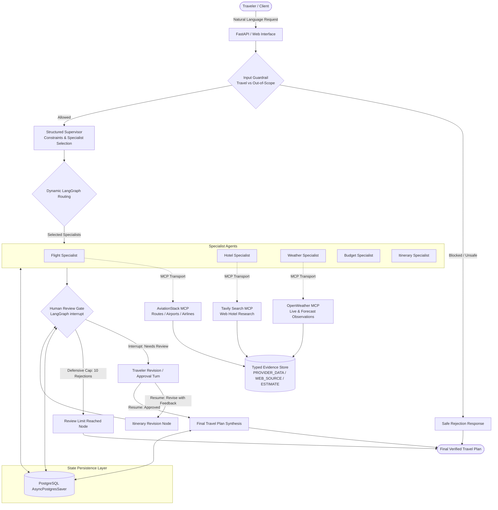

# TripBandhu — System Architecture

TripBandhu is a stateful agentic travel research system designed to coordinate specialist agents, live external capabilities via Model Context Protocol (MCP), evidence-aware synthesis, and iterative human-in-the-loop (HITL) review.

---

## 1. Architectural Topology

---

## 2. Core Architectural Pillars

### A. Dynamic Supervisor Routing
Rather than running an expensive, fixed pipeline for every request, TripBandhu's Structured Supervisor analyzes constraints (destination, origin, duration, budget, travel style) and activates **only** the required specialists. A flight-only query invokes exclusively the Flight specialist and finishes without forcing itinerary generation or review interrupts.

### B. MCP as Capability Transport
TripBandhu integrates external systems via Model Context Protocol (MCP) tool servers:
- **AviationStack (`aviationstack-mcp==1.6.0`)**: Resolves route queries (`list_routes`), airport codes (`list_airports`), and airline information (`list_airlines`).
- **Tavily Search**: Collects web accommodation research with bounded citations and snippets.
- **OpenWeather**: Retrieves live weather observations (`get_current_weather`) and multi-day forecasts (`get_forecast`).

Specialist access is governed by an **allowlisted capability registry** (`capability_registry.py`) that strictly validates tool names, detects MCP schema drift (`CONTRACT_MISMATCH`), and blocks cross-specialist tool execution.

### C. Typed Evidence & Provenance Semantics
Raw provider outputs are normalized into structured `CapabilityEvidence` with explicit temporal and provenance tags:
- `PROVIDER_DATA` + `REFERENCE`: Aviation route and airport database records.
- `PROVIDER_DATA` + `LIVE`: Current meteorological observations.
- `PROVIDER_DATA` + `FORECAST`: Multi-day weather predictions.
- `WEB_SOURCE` + `REFERENCE`: Tavily web search snippets.
- `MODEL_ESTIMATE`: Model-derived budget allocations (explicitly labeled `[MODEL ESTIMATE - Not Live Fare]`).
- `UNAVAILABLE`: Degraded provider states with structured error codes.

### D. Iterative Human-in-the-Loop (HITL) State Machine
Multi-day itinerary requests enter a human review gate via LangGraph's native `interrupt()`. The traveler can:
1. **Approve**: Immediately advances to `final_agent` synthesis.
2. **Revise**: Submits natural language feedback (e.g., "Add more food tours"), triggering `itinerary_revision` while incrementing `review_iteration`.
3. **Defensive Cap**: If 10 rejections occur without approval, the graph terminates safely at `review_limit_reached` with `approved=False`. Reaching the review cap **never** auto-finalizes or produces a fake approved plan.

### E. PostgreSQL Checkpoint Persistence
All state, multi-turn review history, and interrupts are persisted across process boundaries using LangGraph's application-scoped `AsyncPostgresSaver`. In-flight reviews survive backend server restarts, deployments, and worker recycles without losing state.

### F. Quantitative Evaluation Harness
A versioned 50-scenario benchmark suite (`eval/eval_dataset.py` v3.1.0) deterministically validates routing accuracy, guardrail precision, capability permissions, evidence semantics, groundedness, HITL transitions, provider failure classification, and trace observability with 100% pass rates across critical safety invariants.
